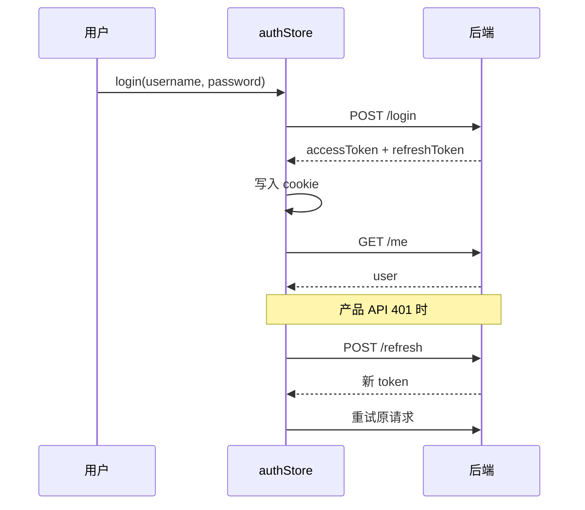

# 鉴权设计

## 模式

内置 **Bearer Token** 前端会话模块，配合 JS 可读 Cookie 存储 access/refresh token，适合基座阶段、演示 API、同域轻量后端与 CSR 产品区快速接入。

当前默认值偏向更严格的前端安全基线：

- token cookie 使用 `sameSite: 'strict'`
- 生产环境 cookie `secure: true`（`NUXT_PUBLIC_APP_ENV=production`）
- 登录 redirect 只允许站内路径，避免开放重定向

更高安全等级的生产系统建议改成后端托管会话：refresh token 由后端写入 `httpOnly + secure + sameSite` Cookie，前端只在内存中持有短期 access token，或通过 BFF 由同源服务代理所有敏感 API。这个基座不内置后端，因此不会伪装提供 `httpOnly` 能力。

## 核心文件

| 文件                         | 职责                                         |
| ---------------------------- | -------------------------------------------- |
| `config/auth.ts`             | 端点路径、cookie 键、过期时间、AuthUser 类型 |
| `app/utils/auth-session.ts`  | 令牌唯一所有者：`useAuthSession()` 读/写/清  |
| `app/api/auth.ts`            | login/register/refresh/logout/me/profile API |
| `app/stores/auth.ts`         | Pinia：user、status、业务 action（无令牌）   |
| `app/composables/useAuth.ts` | `ensureSession()`、`can()`、`hasRole()`      |
| `app/middleware/auth.ts`     | 保护路由、RBAC、登录重定向                   |
| `app/plugins/auth.client.ts` | 启动时 session 恢复（**仅客户端**）          |
| `app/utils/safe-redirect.ts` | 登录 redirect 防开放重定向                   |

## 前端路由 vs 后端端点

| 用途     | 前端页面路径 | 后端 API 路径           |
| -------- | ------------ | ----------------------- |
| 登录     | `/sign-in`   | `POST /login`           |
| 注册     | `/sign-up`   | `POST /register`        |
| 退出     | —            | `POST /logout`          |
| 当前用户 | —            | `GET /me`               |
| 资料     | `/account`   | `GET/PATCH /me/profile` |

`AUTH_REDIRECTS.login = '/sign-in'`

## Token 生命周期



- access token 默认 15 分钟（`ACCESS_TOKEN_MAX_AGE = 900`）
- refresh token 默认 30 天（`REFRESH_TOKEN_MAX_AGE = 2_592_000`）
- token cookie 默认 `sameSite: 'strict'`
- 生产环境 token cookie `secure: true`（`NUXT_PUBLIC_APP_ENV=production`）

## 保护路由

```vue
<script setup lang="ts">
definePageMeta({
  layout: 'product',
  middleware: 'auth'
})
</script>
```

可选 RBAC（当前恒不命中，见下方说明）：

```vue
<script setup lang="ts">
definePageMeta({
  middleware: 'auth',
  auth: {
    roles: ['admin'],
    permissions: ['workspace:write']
  }
})
</script>
```

::: warning 后端刻意不下发 roles
后端有账号角色（`Users.role`，取值 `user` / `admin`），但 `GET /api/v1/me` **不返回**它，
理由写在后端的 `user.contract.ts` 里：把角色下发给浏览器只会诱导前端拿它做权限判断，
而客户端判断从来不是授权——授权在服务端按每次请求查库完成（内容写接口就是这么挂的）。

因此 `normalizeAuthUser()` 把 `roles` / `permissions` 兜底成空数组，
上面这段 `auth.meta` 对任何用户都不会通过，页面会 403。这不是「等后端补字段」的临时状态，
而是既定分工。前端确实需要按角色显示/隐藏 UI 时，应当拿一个**为此设计的**能力标识
（专门的接口或 capability 字段），并且始终只当作展示层开关——真正的拦截在服务端。
:::

## 登录重定向

未登录访问 `/workspace` → 本地化 `/sign-in?redirect=/workspace`（`auth` 中间件通过 `localizedPath(AUTH_REDIRECTS.login, currentLanguage)` 生成登录路径）

sign-in 页使用 `resolveSafeRedirectPath()` 校验 redirect，拒绝 `//evil.com` 等外部 URL。

## 注册与归因

- `registerApi()` 自动 `mergeAttributionIntoBody()` 合并 UTM 等参数
- 注册 **不会** 自动登录，成功后跳转 sign-in 并可选 `?username=` 预填

## 登出

`authStore.logout()` 流程：

1. `POST /logout`（带 refreshToken）
2. `clearAttributionParams()` — **仅 logout 清归因**，不在 `reset()` 里清
3. `reset()` — 清 user 状态，并将 access/refresh cookie 置空

`logout()` **不负责路由跳转**。`AccountPage`、`UserAccountMenu` 等在 `await logout()` 后调用 `router.push(localePath('/'))` 回到首页。

## Session 恢复

`plugins/auth.client.ts`：启动时若 cookie 有 token → `ensureSession()` → fetchMe 或 refresh。

## 为什么会话状态不进 SSR

两条硬性约束，改动鉴权代码时必须一起满足：

1. **令牌不进 Pinia state。** `@pinia/nuxt` 在 `app:rendered` 时执行
   `payload.pinia = toRaw($pinia).state.value`，setup store 返回的任何 ref 都会被写进 SSR HTML。
   因此令牌留在 `app/utils/auth-session.ts` 的 cookie ref 里，store 只通过 `isAuthenticated`
   这类 getter 间接依赖它们。
2. **登录态不影响 SSR 输出。** 公开页有 prerender 与 SWR 缓存，而 Nitro 的缓存键只按 path、
   不区分 cookie；任何随登录态变化的 SSR 输出都会被缓存并发给其他访客。所以鉴权 bootstrap
   是 `.client` 插件，`AppHeader` 的登录态分支包在 `<ClientOnly>` 内。产品区路由本身是
   `ssr: false`，服务端从不需要登录态。

两条约束都由 `tests/unit/ssr-cache-safety.test.ts` 守住。

## 下一步

- [添加 API 请求](/development/add-api)
- [国际化](/architecture/i18n)
