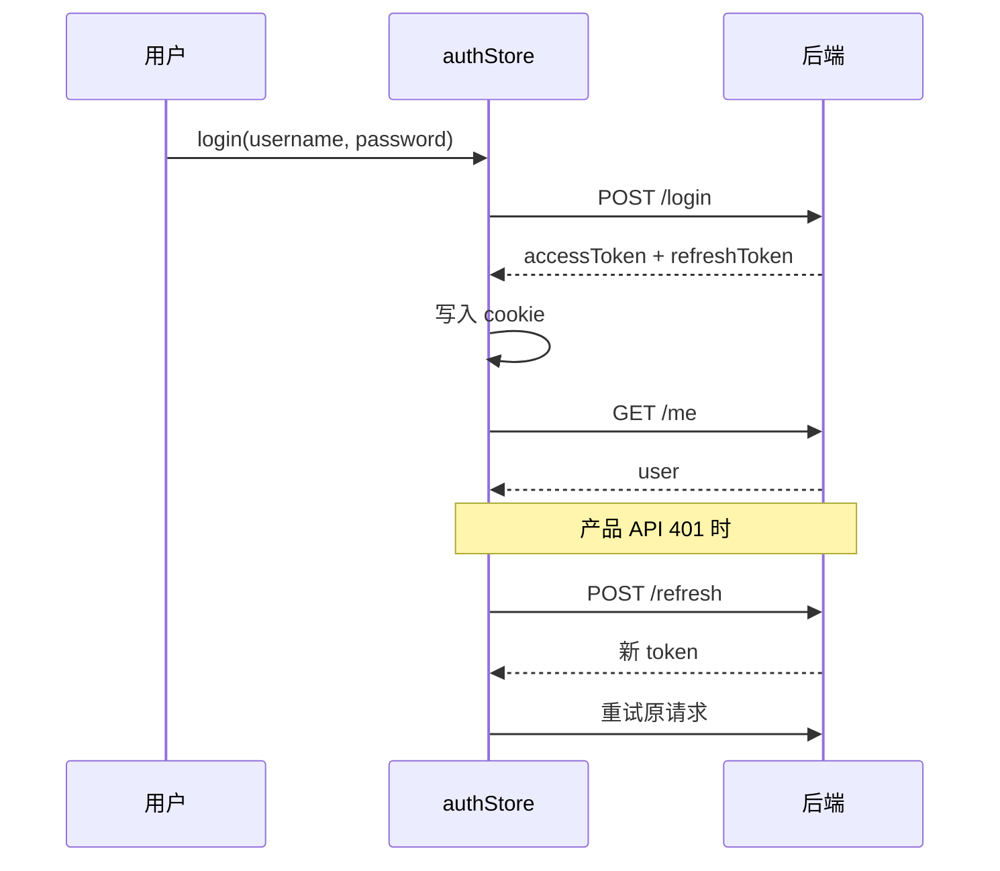

# 鉴权设计

## 模式

可选 **Bearer Token** 模块，配合 JS 可读 Cookie 存储 access/refresh token，适合 CSR 产品区。

## 核心文件

| 文件                         | 职责                                         |
| ---------------------------- | -------------------------------------------- |
| `config/auth.ts`             | 端点路径、cookie 键、过期时间、AuthUser 类型 |
| `app/utils/auth-session.ts`  | cookie 读写、`clearAuthSession()`            |
| `app/api/auth.ts`            | login/register/refresh/logout/me/profile API |
| `app/stores/auth.ts`         | Pinia：user、tokens、status、业务 action     |
| `app/composables/useAuth.ts` | `ensureSession()`、`can()`、`hasRole()`      |
| `app/middleware/auth.ts`     | 保护路由、RBAC、登录重定向                   |
| `app/plugins/auth.ts`        | 启动时 session 恢复                          |
| `app/utils/safe-redirect.ts` | 登录 redirect 防开放重定向                   |

## 前端路由 vs 后端端点

| 用途     | 前端页面路径 | 后端 API 路径           |
| -------- | ------------ | ----------------------- |
| 登录     | `/sign-in`   | `POST /login`           |
| 注册     | `/sign-up`   | `POST /register`        |
| 退出     | —            | `POST /logout`          |
| 当前用户 | —            | `GET /me`               |
| 资料     | `/account`   | `GET/PATCH /me/profile` |

`AUTH_REDIRECTS.login = '/sign-in'`

## Token 生命周期



- access token 默认 15 分钟（`ACCESS_TOKEN_MAX_AGE = 900`）
- refresh token 默认 30 天
- 生产环境 cookie `secure: true`（`NUXT_APP_ENV=production`）

## 保护路由

```vue
<script setup lang="ts">
definePageMeta({
  layout: 'product',
  middleware: 'auth'
})
</script>
```

可选 RBAC（后端暂未返回 roles/permissions，前端预留）：

```vue
<script setup lang="ts">
definePageMeta({
  middleware: 'auth',
  auth: {
    roles: ['admin'],
    permissions: ['workspace:write']
  }
})
</script>
```

## 登录重定向

未登录访问 `/workspace` → 本地化 `/sign-in?redirect=/workspace`（`auth` 中间件通过 `localizedPath(AUTH_REDIRECTS.login, currentLanguage)` 生成登录路径）

sign-in 页使用 `resolveSafeRedirectPath()` 校验 redirect，拒绝 `//evil.com` 等外部 URL。

## 注册与归因

- `registerApi()` 自动 `mergeAttributionIntoBody()` 合并 UTM 等参数
- 注册 **不会** 自动登录，成功后跳转 sign-in 并可选 `?username=` 预填

## 登出

`logout()` 流程：

1. `POST /logout`（带 refreshToken）
2. `clearAttributionParams()` — **仅 logout 清归因**，不在 `reset()` 里清
3. `clearAuthSession()` — 清 cookie + store reset
4. 跳转首页

## Session 恢复

`plugins/auth.ts`：启动时若 cookie 有 token → `ensureSession()` → fetchMe 或 refresh。

## 下一步

- [添加 API 请求](/development/add-api)
- [国际化](/architecture/i18n)
