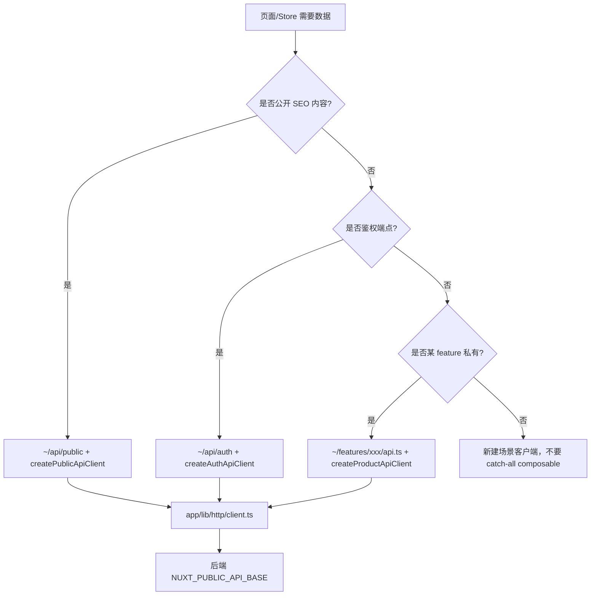

# 架构总览

## 一句话

公开 SEO 页与登录产品页 **共用 Nuxt 基础设施**，但在 **路由、渲染、数据、模块** 上严格分离；页面保持轻薄，业务逻辑收敛在 `app/features/*`。

## 系统分层

```
┌──────────────────────────────────────────────────────────────┐
│                        用户浏览器                              │
└────────────────────────────┬─────────────────────────────────┘
                             │
┌────────────────────────────▼─────────────────────────────────┐
│  app/pages          路由入口（薄）                             │
│  app/layouts        布局壳（default / product / editor / account）│
│  app/middleware     locale.global + auth（命名）               │
│  app/features/*     业务 UI + feature API                      │
│  app/composables    共享运行时 API                             │
│  app/stores         auth / language / theme                    │
│  app/assets/styles  tokens/ + patterns/ + main.scss            │
└────────────────────────────┬─────────────────────────────────┘
                             │
┌────────────────────────────▼─────────────────────────────────┐
│  app/api            跨特性适配器（public / auth / clients）     │
│  app/lib/http       $fetch 封装、信封校验、401 重试              │
└────────────────────────────┬─────────────────────────────────┘
                             │  NUXT_PUBLIC_API_BASE
┌────────────────────────────▼─────────────────────────────────┐
│  后端 API（nuxt-modern-starter-api 或自建）                     │
│  统一响应：{ code, message, data }                              │
└──────────────────────────────────────────────────────────────┘

┌──────────────────────────────────────────────────────────────┐
│  server/routes      sitemap.xml / robots.txt                   │
│  server/api         POST /api/revalidate（SWR 按需失效）         │
│  server/middleware  产品 URL canonical 301                     │
│  config/*           站点元数据、路由规则、鉴权常量、主题 token    │
│  i18n/*             语言包与切换 helper                         │
└──────────────────────────────────────────────────────────────┘
```

## 请求路径决策



## 中间件执行顺序

1. **`server/middleware/product-canonical.ts`**（服务端最早）
   - `/en/workspace` → 301 → `/workspace`

2. **`locale.global.ts`**（全局，每个路由）
   - 去尾斜杠、/zh 重定向、不支持语言 404、加载 i18n、更新 language store
   - 客户端侧产品 URL canonical 301

3. **`auth.ts`**（命名，产品页显式 `definePageMeta`）
   - `ensureSession()` → 未登录跳转本地化 `/sign-in?redirect=`
   - 可选 `meta.auth.roles` / `permissions` → 403

## Layout 与 Feature 对应

| Layout    | 使用场景     | Shell 组件                                  |
| --------- | ------------ | ------------------------------------------- |
| `default` | 公开营销页   | AppHeader + AppFooter                       |
| `product` | 工作台、模板 | ProductShell 侧边栏 + AppShellHeader        |
| `editor`  | 文档编辑器   | 仅 `<slot />`（全屏；Header 在 feature 内） |
| `account` | 账户设置     | AccountShell                                |
| `empty`   | 错误页等     | 最小壳                                      |

## Feature 模块地图

| Feature         | 职责                           | `index.ts` 对外导出                  | 内部组件 / 配置（勿跨 feature 直接引用）     |
| --------------- | ------------------------------ | ------------------------------------ | -------------------------------------------- |
| `product-shell` | 产品区侧边栏导航配置           | `ProductShell`, `productNavItems`, … | `productFooterNavItems` 等同目录 config 导出 |
| `account-shell` | 账户区壳层                     | `AccountShell`                       | `accountNavItems`（`config.ts`，壳层内部用） |
| `workspace`     | 项目列表/卡片、路由预加载      | `WorkspaceDashboard`, workspace API  | `WorkspaceProjectCard`                       |
| `editor`        | PPT 编辑器、自动保存、标题编辑 | `EditorWorkspace`, editor API        | `EditorWorkspaceHeader`                      |
| `templates`     | 主题模板占位                   | `ThemeTemplatesPage`                 | —                                            |
| `account`       | 账户信息展示                   | `AccountPage`                        | —                                            |

## 插件启动链

| 插件                    | 时机      | 作用                         |
| ----------------------- | --------- | ---------------------------- |
| `i18n.ts`               | universal | 按路由加载语言包             |
| `auth.ts`               | universal | 有 cookie 时恢复 session     |
| `attribution.client.ts` | client    | 捕获 UTM 等归因参数          |
| `analytics.client.ts`   | client    | 延迟加载统计脚本（默认关闭） |

## 配置单一来源

以下逻辑 **不要散落在页面里重复实现**：

| 关注点                     | 单一来源                                   |
| -------------------------- | ------------------------------------------ |
| 公开页路径列表             | `config/site.ts` → `PUBLIC_PAGE_PATHS`     |
| prerender / SWR / CSR 规则 | `config/routes.ts`                         |
| 产品 URL 是否语言中性      | `isProductPath()`                          |
| 鉴权端点与 cookie 键       | `config/auth.ts`                           |
| hreflang / sitemap         | `config/routes.ts` + `server/utils/seo.ts` |

## 下一步

- [目录结构](/architecture/directory) — 逐目录说明
- [路由与渲染](/architecture/routing) — SSR/prerender/SWR/CSR 详解与各页面亮点
- [请求与数据流](/architecture/data-flow) — HTTP 层与 API 适配器
