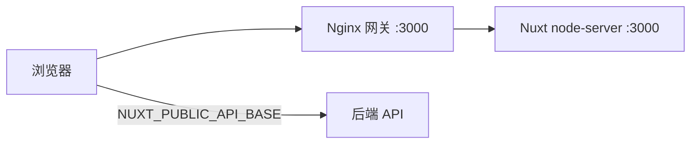

# 部署概览

## 默认目标

**Nitro `node-server`** — 构建产物启动方式：

```bash
pnpm build
node .output/server/index.mjs
```

监听端口默认 **3000**。`nuxt.config.ts` 默认 `runtimeConfig.public.apiBase` = `http://localhost:2027/api/v1`、`siteUrl` = `http://localhost:3000`。

## 部署架构



- 静态资源 `/_nuxt/` 由 Nginx 长缓存
- **API 请求浏览器直连后端**，不经过 Nginx（需 CORS）

## 环境层

| 命令             | dotenv      |
| ---------------- | ----------- |
| `pnpm dev`       | `.env.dev`  |
| `pnpm build`     | `.env.prod` |
| `pnpm build:dev` | `.env.dev`  |

Committed env 文件只放占位默认值，**真实密钥运行时注入**。

## SWR 页面缓存与多实例

`routeRules` 的 SWR 缓存**默认存在进程内存里**（`config/cache.ts` 的默认驱动）。
单进程部署没问题；一旦横向扩容（pm2 cluster、多容器副本），每个进程各持一份缓存，
而 `POST /api/revalidate` 只会打到其中一个进程 —— **其余进程继续发陈旧 HTML 直到 TTL 到期**。

实测（Nuxt 4.4.8 / Nitro 2.13.4，两个进程）：

| 驱动                   | 向实例 A 发 revalidate 后          |
| ---------------------- | ---------------------------------- |
| 默认（内存）           | A 重新生成，**B 仍发旧内容**       |
| `NUXT_CACHE_DRIVER=fs` | 共享条目被删除，**A / B 同时失效** |

这两个变量在**构建期**求值（Nitro 的 `nitro.storage` 是构建期配置），Docker 里用 build arg 传入：

```bash
# 同机多进程：挂一个共享卷到 base 指向的目录
NUXT_CACHE_DRIVER=fs NUXT_CACHE_FS_BASE=/data/cache pnpm build
```

跨主机部署需要共享驱动（redis 等）。`config/cache.ts` 只内置 `memory` 与 `fs` 以保持零额外依赖；
接入 redis 请在 `nuxt.config.ts` 的 `nitro.storage.cache` 直接配置并安装对应 driver 依赖。
配错驱动名会在构建期直接报错，不会静默回退到内存。

## 发布流程

```bash
pnpm quality
pnpm docker:build    # 可选
pnpm docker:up       # 可选 Compose 栈
```

## 全栈联调验证

配合 `nuxt-modern-starter-api`：

1. 在 **`nuxt-modern-starter-api` 后端仓库** 启动栈（常见命令 `pnpm docker:dev`；前端 Compose 用 `pnpm docker:up:dev`）
2. 前端 `NUXT_PUBLIC_API_BASE=http://localhost:2027/api/v1`
3. 后端 CORS 包含 `http://localhost:3000`
4. 验证：登录 → 工作台（列表/删除/创建跳转 `/docs/new`）→ 编辑器自动保存 → 账户
5. 新闻变更后：后端 webhook 调用 `POST /api/revalidate`（需配置 `NUXT_REVALIDATE_SECRET`）

## 产品区工作流（联调参考）

| 步骤 | 路由                    | 行为                                                                                                     |
| ---- | ----------------------- | -------------------------------------------------------------------------------------------------------- |
| 1    | `/sign-up` → `/sign-in` | 注册不自动登录；登录写 cookie 并 fetchMe                                                                 |
| 2    | `/workspace`            | 列表/删除项目；创建按钮跳转 `/docs/new`（预加载 editor route）                                           |
| 3    | `/docs/new`             | 草稿模式；`WORKSPACE_NEW_PROJECT_ID` + `ensureDraftProject`；`EDITOR_AUTOSAVE_DEBOUNCE_MS`（2s）自动保存 |
| 4    | `/docs/:id`             | 加载项目 + documentId；debounce 自动保存；标题双写 document/project                                      |
| 5    | `/account`              | `fetchProfileApi` 展示扩展资料；UserAccountMenu 退出清归因                                               |

## 文档站（GitHub Pages）

VitePress 文档站由 `.github/workflows/deploy-docs.yml` 自动部署：

1. 仓库 **Settings → Pages → Source** 选择 **GitHub Actions**
2. 推送 `main` 上 `docs-site/**` 变更，或手动 **Actions → Deploy Docs → Run workflow**
3. 访问 `https://<user>.github.io/nuxt-modern-starter/`（CI 注入 `VITEPRESS_BASE=/nuxt-modern-starter/`）

本地构建仍用根路径：`pnpm docs:dev` / `pnpm docs:build`。

## 下一步

- [环境变量](/deployment/env)
- [Docker](/deployment/docker)
