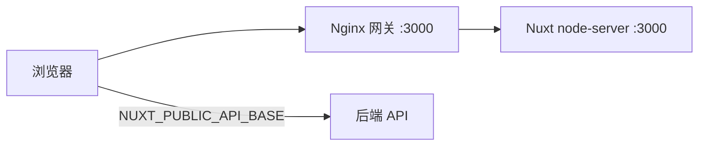

# 部署概览

## 默认目标

**Nitro `node-server`** — 构建产物启动方式：

```bash
pnpm build
node .output/server/index.mjs
```

监听端口默认 **3000**。`nuxt.config.ts` 默认 `runtimeConfig.public.apiBase` = `http://localhost:2026/api`、`siteUrl` = `http://localhost:3000`。

## 部署架构



- 静态资源 `/_nuxt/` 由 Nginx 长缓存
- **API 请求浏览器直连后端**，不经过 Nginx（需 CORS）

## 环境层

| 命令             | dotenv      |
| ---------------- | ----------- |
| `pnpm dev`       | `.env.dev`  |
| `pnpm build`     | `.env.prod` |
| `pnpm build:dev` | `.env.dev`  |

Committed env 文件只放占位默认值，**真实密钥运行时注入**。

## 发布流程

```bash
pnpm quality
pnpm docker:build    # 可选
pnpm docker:up       # 可选 Compose 栈
```

## 全栈联调验证

配合 `nuxt-modern-starter-api`：

1. 在 **`nuxt-modern-starter-api` 后端仓库** 启动栈（常见命令 `pnpm docker:dev`；前端 Compose 用 `pnpm docker:up:dev`）
2. 前端 `NUXT_PUBLIC_API_BASE=http://localhost:2026/api`
3. 后端 CORS 包含 `http://localhost:3000`
4. 验证：登录 → 工作台（列表/删除/创建跳转 `/docs/new`）→ 编辑器自动保存 → 账户
5. 新闻变更后：后端 webhook 调用 `POST /api/revalidate`（需配置 `NUXT_REVALIDATE_SECRET`）

## 产品区工作流（联调参考）

| 步骤 | 路由                    | 行为                                                                                                     |
| ---- | ----------------------- | -------------------------------------------------------------------------------------------------------- |
| 1    | `/sign-up` → `/sign-in` | 注册不自动登录；登录写 cookie 并 fetchMe                                                                 |
| 2    | `/workspace`            | 列表/删除项目；创建按钮跳转 `/docs/new`（预加载 editor chunk）                                           |
| 3    | `/docs/new`             | 草稿模式；`WORKSPACE_NEW_PROJECT_ID` + `ensureDraftProject`；`EDITOR_AUTOSAVE_DEBOUNCE_MS`（2s）自动保存 |
| 4    | `/docs/:id`             | 加载项目 + documentId；debounce 自动保存；标题双写 document/project                                      |
| 5    | `/account`              | `fetchProfileApi` 展示扩展资料；UserAccountMenu 退出清归因                                               |

## 下一步

- [环境变量](/deployment/env)
- [Docker](/deployment/docker)
