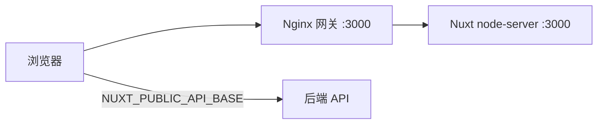

# 部署概览

## 默认目标

**Nitro `node-server`** — 构建产物启动方式：

```bash
pnpm build
node .output/server/index.mjs
```

监听端口默认 **3000**。

## 部署架构



- 静态资源 `/_nuxt/` 由 Nginx 长缓存
- **API 请求浏览器直连后端**，不经过 Nginx（需 CORS）

## 环境层

| 命令             | dotenv      |
| ---------------- | ----------- |
| `pnpm dev`       | `.env.dev`  |
| `pnpm build`     | `.env.prod` |
| `pnpm build:dev` | `.env.dev`  |

Committed env 文件只放占位默认值，**真实密钥运行时注入**。

## 发布流程

```bash
pnpm quality
pnpm docker:build    # 可选
pnpm docker:up       # 可选 Compose 栈
```

## 全栈联调验证

配合 `nuxt-modern-starter-api`：

1. 后端 `pnpm docker:dev`
2. 前端 `NUXT_PUBLIC_API_BASE=http://localhost:2026/api`
3. 后端 CORS 包含 `http://localhost:3000`
4. 验证：登录 → 工作台 → 编辑器 → 账户

## 下一步

- [环境变量](/deployment/env)
- [Docker](/deployment/docker)
