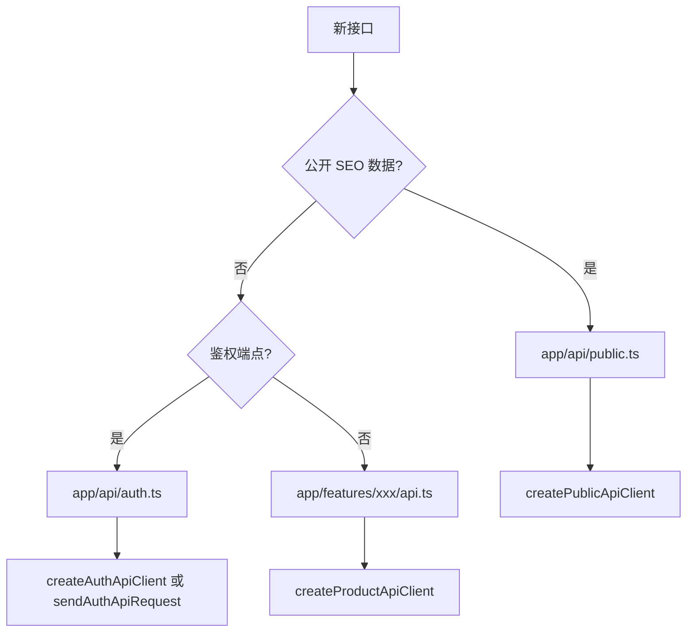

# 添加 API 请求

## 决策流程



## 示例：Feature 私有 API

`app/features/billing/api.ts`：

```ts
import type { ApiResponse } from '~/lib/http/types'
import { createProductApiClient } from '~/api/auth'

export type Invoice = { id: string; amount: number }

export const fetchInvoices = () =>
  createProductApiClient().request<ApiResponse<{ invoices: Invoice[] }>>('/invoices', {
    method: 'GET'
  })
```

`app/features/billing/index.ts`：

```ts
export * from './api'
export { default as BillingDashboard } from './components/BillingDashboard.vue'
```

组件中使用：

```ts
import { fetchInvoices } from '~/features/billing'

const { data, error, refresh } = await useAsyncData('invoices', () => fetchInvoices())
```

## 示例：公开内容 API

`app/api/public.ts`：

```ts
export const fetchCaseStudies = (locale: SupportedLocale) =>
  createPublicApiClient({ locale }).request('/content/cases', { method: 'GET' })
```

## 错误处理

```ts
import { getApiErrorMessage } from '~/lib/http/error'

try {
  await fetchInvoices()
} catch (error) {
  message.error(getApiErrorMessage(error, t('common.loadFailed')))
}
```

产品页推荐 pattern：`a-alert` + 重试按钮（参考 `WorkspaceDashboard`、`AccountPage`）。

## 路径约定

- `NUXT_PUBLIC_API_BASE` = `http://localhost:2026/api`
- 适配器内 path = `/projects`（**不要**重复 `/api`）

## 测试

为新适配器添加 `tests/unit/<feature>-api.test.ts`，mock `createProductApiClient` 或 `createPublicApiClient`。

参考：`tests/unit/workspace-api.test.ts`

## 禁止事项

- 页面内 `$fetch(runtimeConfig.public.apiBase + '/xxx')`
- 公开 adapter 读 token cookie
- 通用 `useRequest()` 封装

## 下一步

- [请求与数据流](/architecture/data-flow)
- [鉴权设计](/architecture/auth)
