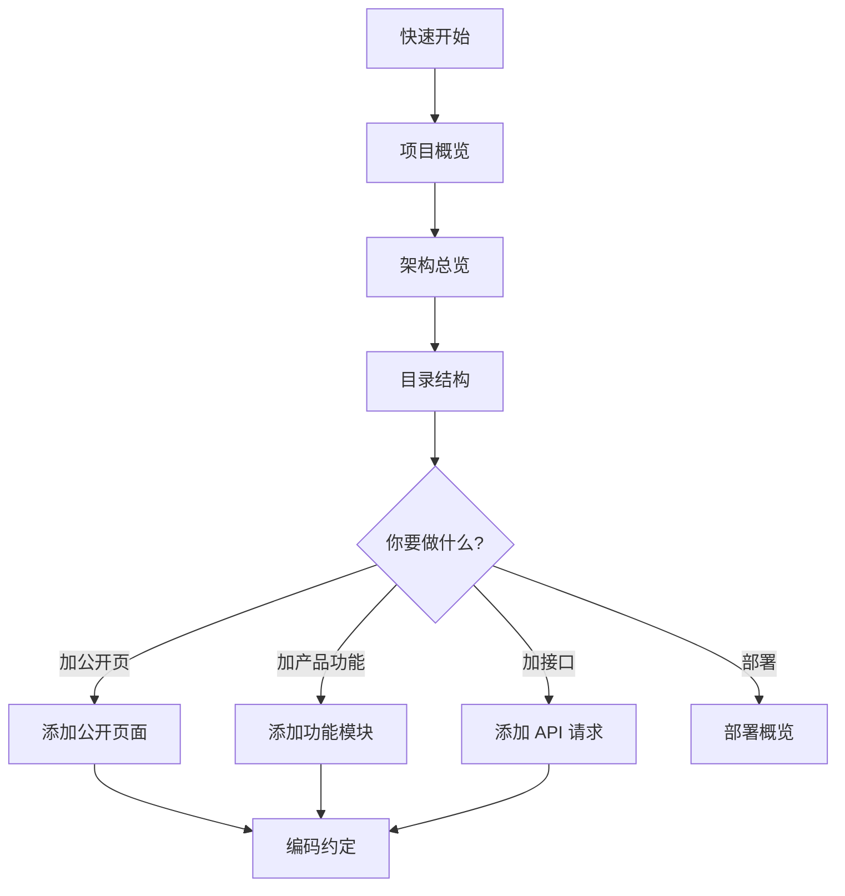

# 项目概览

## 这是什么？

**Nuxt Modern Starter** 是一个可复用的 **Nuxt 4 通用 SaaS 前端基座**，面向：

- 营销官网、落地页
- SEO 内容站（新闻、帮助、定价）
- 多语言公开页面
- SaaS 产品前台（账号、用户工作台、项目、编辑器、自动保存、后续商业化）
- AI 应用、内容工具、生产力工具、创作者工具或轻量业务系统

它不是「全栈框架」，也不绑定某一种业务形态，而是把 **公开官网 + 登录后产品区** 的边界、渲染策略、请求分层、SEO、i18n、鉴权、主题系统和部署样例都预置好，让你专注具体 SaaS 业务。会员、额度、订单、支付等商业化能力可以后续作为产品扩展接入；组织、团队、邀请和协作权限不进入默认架构，只有在项目明确选择团队协作方向时再补。

## 核心设计思想

### 1. 公开区 vs 产品区

```
┌─────────────────────────────────────────────────────────┐
│  公开 SEO 区（可本地化 URL）                              │
│  /  /pricing  /about  /help  /news  /sign-in  /sign-up  │
│  渲染：SSR / prerender / SWR                             │
│  数据：无 token，可缓存                                   │
└─────────────────────────────────────────────────────────┘

┌─────────────────────────────────────────────────────────┐
│  登录产品区（语言中性 URL）                               │
│  /workspace  /workspace/templates  /docs/:id  /account  │
│  渲染：CSR（客户端）                                      │
│  数据：Bearer Token，项目与编辑器会话感知                  │
└─────────────────────────────────────────────────────────┘
```

**为什么要分开？**

- SEO 页需要 SSR/静态化/SWR，HTML 可被爬虫和 CDN 缓存
- 产品页强交互、依赖登录态，适合 CSR，且 URL 不应随 UI 语言变化
- `config/routes.ts` 中 `productRoutePatterns` 定义产品区路径；`csrRouteRules` 供 `nuxt.config.ts` `routeRules` 设置 `ssr: false`

### 2. 页面薄、功能厚

Nuxt 页面文件（`app/pages/*`）只做：

- `definePageMeta`（layout、middleware）
- `usePageSeo`（公开页）
- 挂载 `app/features/*` 里的业务组件

复杂 UI、API、状态放在 **feature 模块** 里。

### 3. 按场景选 API 客户端

| 场景          | 入口                       | 特点                    |
| ------------- | -------------------------- | ----------------------- |
| 公开内容      | `createPublicApiClient()`  | 剥离 token，SSR 安全    |
| 登录注册      | `createAuthApiClient()`    | 鉴权端点                |
| 工作台/编辑器 | `createProductApiClient()` | 自动带 token + 401 刷新 |

页面和 Store **不直接写后端 URL**，只调 `~/api/*` 或 feature-local API 里的命名函数。

## 预置功能清单

| 模块     | 路由                            | 渲染方式        | 说明                                               |
| -------- | ------------------------------- | --------------- | -------------------------------------------------- |
| 首页     | `/`、`/en`                      | **prerender**   | 营销落地页五段式 + WebPage/Organization JSON-LD    |
| 关于     | `/about`、`/en/about`           | **prerender**   | 使命 / 价值观 / 背景；纯 i18n                      |
| 帮助     | `/help`、`/en/help`             | **prerender**   | 快速上手 + 资源清单 + FAQ 折叠                     |
| 定价     | `/pricing`、`/en/pricing`       | **SSR**（默认） | 三档方案 + Includes；内容来自 API                  |
| 新闻列表 | `/news`、`/en/news`             | **SWR 3600s**   | 卡片列表；摘要来自 API；支持按需 revalidate        |
| 新闻详情 | `/news/:slug`、`/en/news/:slug` | **SWR 3600s**   | 正文来自 API；Article JSON-LD；支持按需 revalidate |
| 登录     | `/sign-in`、`/en/sign-in`       | **SSR**（默认） | noindex；安全 redirect，默认进工作台               |
| 注册     | `/sign-up`、`/en/sign-up`       | **SSR**（默认） | noindex；不自动登录，跳转登录预填用户名            |
| 404 兜底 | 未匹配的公开路径                | **SSR**（默认） | HTTP 404 + noindex                                 |
| 工作台   | `/workspace`                    | **CSR**         | 列表/删除；创建走 `/docs/new`；路由预加载          |
| 模板     | `/workspace/templates`          | **CSR**         | 可选模板入口：6 张占位卡片 + 空状态                |
| 编辑器   | `/docs/:id`、`/docs/new`        | **CSR**         | PPT 编辑器；草稿首次保存创建项目；2s 自动保存      |
| 账户     | `/account`                      | **CSR**         | profile 展示 + 退出回首页                          |

完整页面文件路径、渲染策略与 UI 亮点见 [路由与渲染 — 各页面渲染方式](/architecture/routing#各页面渲染方式) 与 [各页面亮点](/architecture/routing#各页面亮点)。

## 技术栈一览

| 类别   | 选型                                                                                                                                         |
| ------ | -------------------------------------------------------------------------------------------------------------------------------------------- |
| 框架   | Nuxt 4.4.8 + Vue 3.5 + TypeScript                                                                                                            |
| 包管理 | pnpm 11                                                                                                                                      |
| 状态   | Pinia                                                                                                                                        |
| UI     | Ant Design Vue 4                                                                                                                             |
| 样式   | SCSS 分层 token（`tokens/` + `patterns/` + `--app-*`）                                                                                       |
| i18n   | vue-i18n（自建路由，不用 @nuxtjs/i18n）                                                                                                      |
| 编辑器 | @yanivjs/yaniv-editor 0.3.0（`mode: edit`, `preset: full`）                                                                                  |
| 测试   | Vitest 4.1.11 + @nuxt/test-utils 4.0.3；`vitest.config.ts` 用 `defineVitestConfig` + `include: tests/**/*.test.ts`（55 测试文件 / 329 用例） |
| 部署   | Nitro node-server + Docker + Nginx 样例                                                                                                      |

详见 [技术栈总览](/tech-stack/overview)。

## 新人阅读路线



## 下一步

- [架构总览](/architecture/overview) — 运行时流程与模块关系
- [目录结构](/architecture/directory) — 每个目录的职责
