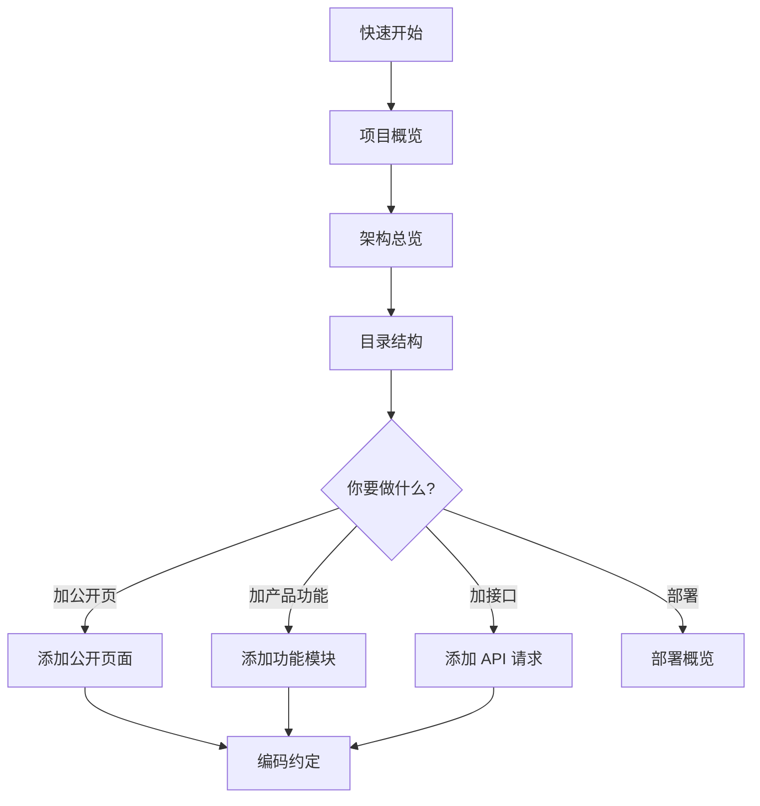

# 项目概览

## 这是什么？

**Nuxt Modern Starter** 是一个可复用的 **Nuxt 4 前台 starter**，面向：

- 营销官网、落地页
- SEO 内容站（新闻、帮助、定价）
- 多语言公开页面
- 轻量 SaaS 产品前台（工作台、编辑器、账户中心）

它不是「全栈框架」，而是把 **公开站 + 登录产品区** 的边界、渲染策略、请求分层、SEO、i18n、鉴权、部署样例都预置好，让你专注业务功能。

## 核心设计思想

### 1. 公开区 vs 产品区

```
┌─────────────────────────────────────────────────────────┐
│  公开 SEO 区（可本地化 URL）                              │
│  /  /pricing  /about  /help  /news  /sign-in  /sign-up  │
│  渲染：SSR / prerender / SWR                             │
│  数据：无 token，可缓存                                   │
└─────────────────────────────────────────────────────────┘

┌─────────────────────────────────────────────────────────┐
│  登录产品区（语言中性 URL）                               │
│  /workspace  /workspace/templates  /docs/:id  /account  │
│  渲染：CSR（客户端）                                      │
│  数据：Bearer Token，会话感知                             │
└─────────────────────────────────────────────────────────┘
```

**为什么要分开？**

- SEO 页需要 SSR/静态化/SWR，HTML 可被爬虫和 CDN 缓存
- 产品页强交互、依赖登录态，适合 CSR，且 URL 不应随 UI 语言变化

### 2. 页面薄、功能厚

Nuxt 页面文件（`app/pages/*`）只做：

- `definePageMeta`（layout、middleware）
- `usePageSeo`（公开页）
- 挂载 `app/features/*` 里的业务组件

复杂 UI、API、状态放在 **feature 模块** 里。

### 3. 按场景选 API 客户端

| 场景          | 入口                       | 特点                    |
| ------------- | -------------------------- | ----------------------- |
| 公开内容      | `createPublicApiClient()`  | 剥离 token，SSR 安全    |
| 登录注册      | `createAuthApiClient()`    | 鉴权端点                |
| 工作台/编辑器 | `createProductApiClient()` | 自动带 token + 401 刷新 |

页面和 Store **不直接写后端 URL**，只调 `~/api/*` 或 `~/features/*/api.ts` 里的命名函数。

## 预置功能清单

| 模块      | 路由                     | 说明                                      |
| --------- | ------------------------ | ----------------------------------------- |
| 首页      | `/`、`/en`               | prerender，WebPage/Organization JSON-LD   |
| 定价      | `/pricing`               | SWR，内容来自 API                         |
| 关于      | `/about`                 | prerender，纯 i18n                        |
| 帮助      | `/help`                  | prerender，FAQ 本地数据                   |
| 新闻      | `/news`、`/news/:slug`   | SWR，Article JSON-LD                      |
| 登录/注册 | `/sign-in`、`/sign-up`   | noindex                                   |
| 工作台    | `/workspace`             | CSR，项目 CRUD                            |
| 模板      | `/workspace/templates`   | CSR，占位 UI                              |
| 编辑器    | `/docs/:id`、`/docs/new` | CSR，YanivEditor PPT 编辑器 + 2s 自动保存 |
| 账户      | `/account`               | CSR，profile + 退出                       |

## 技术栈一览

| 类别   | 选型                                    |
| ------ | --------------------------------------- |
| 框架   | Nuxt 4.4 + Vue 3.5 + TypeScript         |
| 包管理 | pnpm 11                                 |
| 状态   | Pinia                                   |
| UI     | Ant Design Vue 4                        |
| 样式   | SCSS + CSS 变量 token                   |
| i18n   | vue-i18n（自建路由，不用 @nuxtjs/i18n） |
| 编辑器 | @yanivjs/yaniv-editor                   | PPT/幻灯片编辑器（`mode: edit`, `preset: full`） |
| 测试   | Vitest 4.1.9 + @nuxt/test-utils 4.0.3   | Nuxt 环境 + 单元测试（22 文件 / 81 用例）        |
| 部署   | Nitro node-server + Docker + Nginx 样例 |

详见 [技术栈总览](/tech-stack/overview)。

## 新人阅读路线



## 下一步

- [架构总览](/architecture/overview) — 运行时流程与模块关系
- [目录结构](/architecture/directory) — 每个目录的职责
