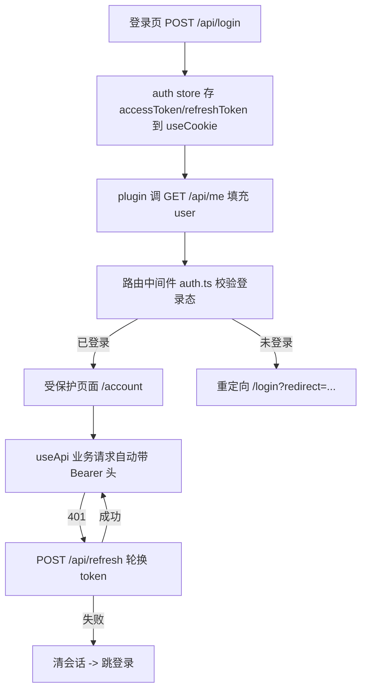

# 增加登录/注册/登出 + 权限路由守卫（对接 express-modern-starter）

> 方案：nuxt-modern-starter 前端增加鉴权与登录态路由守卫，采用 **Bearer Token 模式** 对接后端 `express-modern-starter`，权限体系先做登录态守卫并预留可扩展的角色/权限抽象层。

## 一、背景与约束（来自后端契约梳理）

- 后端前缀 `/api`，鉴权响应包络为 `{ code, msg, ...平铺字段 }`（注意是 `msg` 不是 `message`，且无 `data` 嵌套）。前端把这种后端差异限制在 `app/apis/auth.ts`：鉴权接口单独用 `$fetch` 请求，并通过 `normalizeFlatApiResponse()` 统一归一化为应用内 `message` 字段。
- 鉴权模式：**Bearer Token**。`POST /api/login` 返回 `token / accessToken / refreshToken / accessTokenExpiresIn(900s) / refreshTokenExpiresIn(2592000s)`。Bearer 模式**不需要 CSRF**。
- 端点清单：
  - `POST /api/register`：注册（**不自动登录**，需再调 login）
  - `POST /api/login`：登录，返回 token 对
  - `POST /api/refresh`：body 传 `{ refreshToken }` 免 CSRF，轮换 token
  - `POST /api/logout`：需认证 + body/cookie 传 refreshToken
  - `GET /api/me`：返回 `{ user: { id, username, avatar, nickname } }`
  - `GET /api/me/profile`：扩展资料
  - `PATCH /api/me/profile`：更新资料
- 后端**无 RBAC**：JWT 仅含 `id` + `username`，`/api/me` 无角色字段。因此权限守卫**先做登录态**，角色/权限做成前端抽象层并预留数据源 TODO。
- 错误：HTTP 状态码与 body.code 一致；401 文案示例 `未登录或无效登录凭证`；400 校验文案用 `; ` 拼接；409 `用户名已存在`；429 限流。

## 二、关键设计决策

- **Token 存储**：用 Nuxt `useCookie` 持久化 `accessToken` / `refreshToken`（JS 可写的普通 cookie，非 httpOnly），使 SSR 首屏也能读取并拼 `Authorization: Bearer`，对后端仍是纯 Bearer 模式（不依赖后端 cookie / CSRF）。
- **守卫范围**：官网页面默认公开；鉴权守卫做成**按页 opt-in**（`definePageMeta`），不做全局强制，避免影响 SEO 公开页。
- **权限抽象层**：现在就建好 `hasRole` / `hasPermission`，角色数组暂时为空 / TODO，待后端补 RBAC 后仅需在 `fetchMe` 里填充 `roles` 即可启用。

## 三、鉴权流程

## 四、新增 / 修改文件

### 配置与类型

- 新增 `config/auth.ts`：端点路径常量、cookie 存储键、登录/登出重定向路径、`Role` / `Permission` 类型、`AuthUser` 类型（`id / username / avatar / nickname / roles / permissions`）。

### API 层（适配 `{code,msg}` 包络）

- 新增 `app/utils/api-contract.ts`：定义应用内 `{ code, message, data }` 契约和 `normalizeFlatApiResponse()`，用于把后端平铺响应的 `msg` 归一化为 `message`。
- 新增 `app/apis/auth.ts`：用 `$fetch`（baseURL 取 runtimeConfig，注入 Bearer 头）实现 `registerApi / loginApi / refreshApi / logoutApi / fetchMeApi`，只在 API adapter 边界感知后端 `msg` 与平铺字段；store 和页面消费归一化后的 `message`、token 字段、`user`。
- 修改 `app/composables/useApi.ts`：从 token cookie（`useCookie`，server + client 通用）自动注入 `Authorization: Bearer`；`onResponseError` 中 401 触发一次 `refresh` 重试的单飞逻辑（失败则清会话）。保持现有 header 转发与脱敏。

### 状态与会话

- 新增 `app/stores/auth.ts`：Pinia store。state：`user`、tokens（经 `useCookie`）、`status`；getters：`isAuthenticated`、`hasRole`、`hasPermission`；actions：`login / register / logout / fetchMe / refresh / setTokens / reset`。
- 新增 `app/composables/useAuth.ts`：对 store 的人性化封装，暴露 `login / register / logout / ensureSession` 与权限助手 `can()` / `hasRole()`。
- 新增 `app/plugins/auth.ts`：应用启动（含 SSR）时若存在 access token cookie 则调 `/api/me` 水合 `user`，使 SSR 侧守卫可用；access 失效但有 refresh 时先刷新。

### 路由守卫

- 新增 `app/middleware/auth.ts`：命名中间件。未登录 → 重定向本地化 `/login?redirect=<原路径>`；读取 `route.meta.auth.roles / permissions` 做权限校验（当前 roles 为空，预留）。

### 页面

- 新增 `app/pages/[[language]]/login.vue`：Ant Design 表单，登录成功按 `redirect` query 跳转，`usePageSeo` 设 `noindex`。
- 新增 `app/pages/[[language]]/register.vue`：注册成功后引导登录（后端不自动登录），`noindex`。
- 新增 `app/pages/[[language]]/account.vue`：受保护示例页，`definePageMeta({ middleware: 'auth' })`，展示 `/api/me/profile` 资料 + 登出按钮。

### 头部与导航

- 修改 `app/components/layout/AppHeader.vue`：未登录显示"登录"链接；已登录显示用户名 + 登出（`a-dropdown`），登出调用 `logout` 并跳首页。

### i18n

- 修改 `i18n/zh-CN/index.ts` 与 `i18n/en-US/index.ts`：新增 `auth.*` 文案（登录 / 注册 / 登出 / 账户 / 表单校验 / 错误提示）。

### 环境与运行时

- 修改 `nuxt.config.ts` / `.env.dev` 等：`apiBase` / `public.apiBase` 指向后端 `/api`（开发可复用现有 `devProxy` 同源代理规避 CORS）。后端开发态默认放开 CORS，生产需把前端 origin 加入后端 `CORS_ORIGINS`。

### 测试（沿用 tests/unit 现有风格）

- 新增 `tests/unit/auth-store.test.ts`：login 写入 token、logout 清空、fetchMe 填充 user。
- 新增 `tests/unit/auth-permission.test.ts`：`hasRole` / `hasPermission` 抽象逻辑。
- 新增 `tests/unit/auth-middleware.test.ts`：未登录重定向到 `/login`、已登录放行。

### 文档

- 更新 `docs/usage.md` 的 "Auth Extension Contract" 段落，反映实际实现与后端契约、Bearer / RBAC 现状。

## 五、验收标准

- `pnpm lint && pnpm stylelint && pnpm typecheck && pnpm test && pnpm build` 全绿。
- 未登录访问 `/account` 被重定向到 `/login?redirect=/account`，登录后回跳。
- 登录 / 注册 / 登出闭环可用；业务请求自动带 Bearer 且 401 能刷新重试。
- 权限抽象层就位，后端补 RBAC 后仅需在 `fetchMe` 填充 `roles` 即可启用角色守卫。

## 六、后端接口速查（对接参考）

| 端点              | 方法  | 认证 | 请求体                     | 关键返回字段                                                                |
| ----------------- | ----- | ---- | -------------------------- | --------------------------------------------------------------------------- |
| `/api/register`   | POST  | 否   | `username`, `password`     | `code`, `msg`                                                               |
| `/api/login`      | POST  | 否   | `username`, `password`     | `token/accessToken/refreshToken/accessTokenExpiresIn/refreshTokenExpiresIn` |
| `/api/refresh`    | POST  | 否   | `{ refreshToken }`         | 同 login 结构                                                               |
| `/api/logout`     | POST  | 是   | `{ refreshToken }`（可空） | `code`, `msg`                                                               |
| `/api/me`         | GET   | 是   | -                          | `user: { id, username, avatar, nickname }`                                  |
| `/api/me/profile` | GET   | 是   | -                          | `profile: {...} \| null`                                                    |
| `/api/me/profile` | PATCH | 是   | 资料白名单字段             | `profile`                                                                   |

- 后端原始包络：成功 HTTP 200 + `code:200` + 字段平铺；失败 HTTP 状态码 == body.code + `{ code, msg }`。前端应用内统一消费 `message`，不在 store/page 层直接读 `msg`。
- Header：`Authorization: Bearer <accessToken>`（`Bearer ` 后有空格）。
